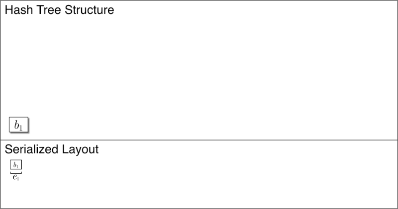

# Slate: Stratified Hash Tree

[](https://github.com/torao/stratified-hash-tree/actions/workflows/build.yml)

このクレートは時間的局所性を持ち不変で木構造の完全な履歴を保持する効率的な追記指向のハッシュツリー (Merkle Tree) 構造である Stratified Hash Tree について説明します (同様のデータ構造やアルゴリズム十分に調査したわけではないが、ここで述べるアルゴリズムに関する呼称や研究などを見つけられていないため、ここでは SLATE という名前で呼びます)。これはログ構造のデータベースとして使用することができる。

## Slate の特徴

* 時系列データのように追加のみが行われるリスト構造。
* データの追加位置を示すインデックスにツリー構造を構築する。このツリー構造は不変であり、ハッシュツリー (Merkle Tree) として使用する
  ことによってデータの破損や改ざんを検出することができる。
* データの増加によってツリーは成長する。ただし、ツリー構造の完全な履歴を保持していることから、ある時点でのハッシュツリーをいつでも参照することが
  できる。
* append, read, range scan, full scan 操作が可能。delete はハッシュ値のみを残し削除することはできる。

## Append



## How to build, test, and benchmark

```shell
rustup default stable
cargo build
cargo test
cargo bench
samply record cargo bench
```

The benchamrks have been moved to a different repository.

* <https://github.com/torao/slate-benchamrk>

## See Also

* [My personal research page for more detail](https://hazm.at/mox/algorithm/structural-algorithm/stratified-hash-tree/index.html).
